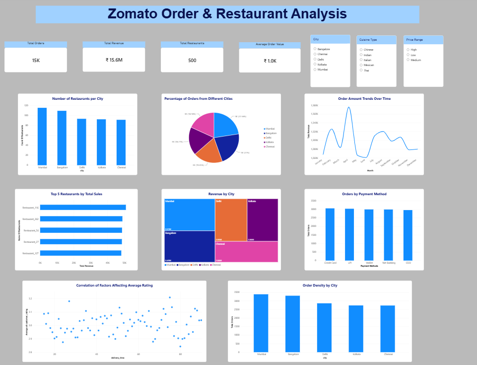

# Zomato Order & Restaurant Analysis

Power BI dashboard analyzing Zomato orders and restaurant performance.

## Dashboard Preview

## Tools Used
- Power BI
- DAX
- Excel
- SQL

## Analysis
- Restaurant analysis by city
- Order distribution by city
- Revenue trends
- Top 5 restaurants
- Revenue by area
- Payment method analysis
- Customer rating analysis
- Order density by city
